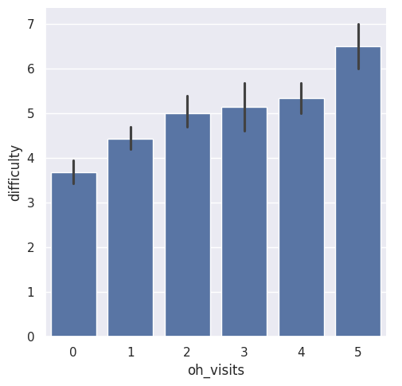
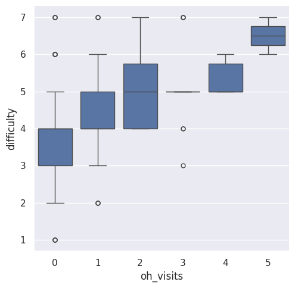
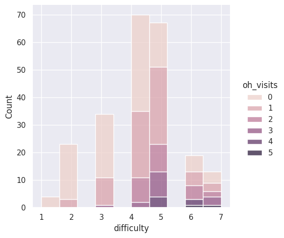

---
# Do not edit the text between these lines!
layout: default
---

# Analysis of COMP110

<!-- This is a comment. Below, you'll see code for inserting an image. To make this image appear, update <custom-path>. To add an image, save it inside the imgs folder of this repository. -->

## The course difficulty with office hours

For my analysis, I will be focusing on the course difficulty and the number of office hour visits. I will be using the survey data to determine if office hours reduce the difficulty of the course.

The data I selected for this project is the difficulty and office hour survey ratings from the surveys of the alyssa and izzi data sets. I then converted the columns into integer values for the purpose of visualizing the ratings. These are the graphs that I received in the end.

## Conclusion
It was found that those who visited office hours actually had rated a higher score in difficulty more than those who haven't gone at all to office hours. This did not prove my initial analysis/hypothesis, but another data group we can look at is looking at prior programming experiences of students. A previous background in programming could mean lower difficulty ratings. From this data, it's determined that students who struggle seek frequent help from office hours.